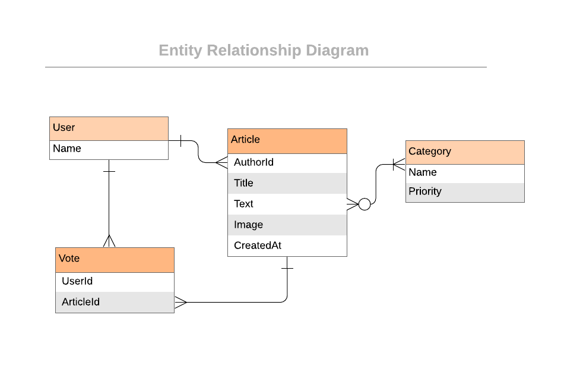

# ThE SilveR ScreeN - A Blog App about Movies and Everything related

> On this project I will develop a blog app, customized with the theme: Movies.
Design idea by [Nelson Sakwa on Behance](https://www.behance.net/gallery/14500909/liFEsTlye-Magazine-style-Design-Freebie)

## You can access the blog [HERE](https://blogthesilverscreen.herokuapp.com/)

## Schema without Extra Feature

The project has 5 Models

- User
- Article
- Vote
- Category
- Bookmarks

Associated to each other as described below:

- User has zero or many articles
- Article belongs to a user
- An Article has zero or many votes
- A User has zero or many votes
- A vote belongs to a User and belongs to an Article
- A bookmark belongs to a User and belongs to an Article
- A Category has many or zero Articles
- An article has one or many Categories

## Features Built

If you're no authenticated User, you can

- Sign Up
- Sign In

If you are an authenticated User, you can

- The user is presented with the homepage, that includes:
 1. Most voted article with full-width image and title in the first row.
 2. List of all categories in order of priority. Each category displayed as a square with its name on the top and its most recent article's title in the bottom. The background image is the image of the most recent article in this category.

- Navbar has links to:
    1. Create a new artice
    2. Home
    3. See your favorite articles

- When the User click on a Category
    1. Display all articles sorted by most recent
    2. Category and preview text truncated
    3. Button to vote or unvote
    4. Button to bookmark or unmark an article

## Built With

- Ruby v2.7.0
- Ruby on Rails v5.2.4
- PostgreSQL, '>= 0.18', '< 2.0'

### Prerequisites

Ruby: 2.6.3
Rails: 5.2.3
Postgres: >=9.5

## Getting Started

To get a local copy up and running follow these simple example steps.

- Clone this repository
- Open a terminal on the containing folder of this project

### Setup

- Run 'bundle install' to install the dependencies
- Set the database using the command 'bin/rake db:migrate'

### Usage

- Run the server using the command 'rails server'
- Access http://localhost:3000/ in your browser
- Use the navbar links to explore the features (make sure to create a user to have access to all features)

## Authors

👤 **Marilena Roque**

- Github: [MarilenaRoque](https://github.com/MarilenaRoque)
- Twitter: [@MariRoq88285995](https://twitter.com/MariRoq88285995)
- Linkedin: [roquemarilena](https://www.linkedin.com/in/roquemarilena/)

## 🤝 Contributing

Contributions, issues and feature requests are welcome!

Feel free to check the [issues page](issues/).

## Show your support

Give a ⭐️ if you like this project!

